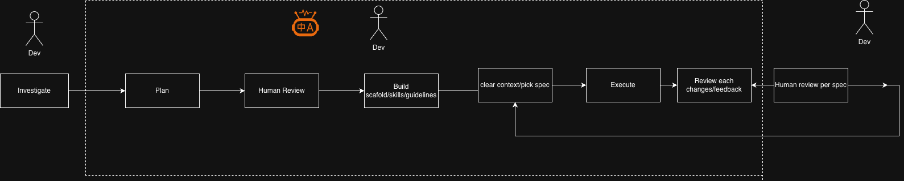

# Clinic Appointment API

RESTful API for booking clinic appointments with clinician scheduling and admin listings.
Built with **NestJS + TypeScript + SQLite** using a pragmatic hexagonal-lite architecture.

---

## Endpoints

| Endpoint | Role | Description |
|---|---|---|
| `POST /appointments` | patient, admin | Book an appointment |
| `GET /clinicians/:id/appointments` | clinician, admin | List clinician's upcoming appointments |
| `GET /appointments` | admin | List all upcoming appointments |
| `GET /health` | any | Health check |

Pass the caller role via `X-Role` header (or `?role=` query param):

```
X-Role: patient | clinician | admin
```

---

## How to run

### Prerequisites

- [OrbStack](https://orbstack.dev) or Docker Desktop

### Start

```bash
make setup   # build image, start container, tail logs
```

API: `http://localhost:3000` — Swagger: `http://localhost:3000/docs`

### Make targets

```bash
make setup                    # build + start + tail logs
make stop                     # stop and remove containers
make run                      # tail logs from running container

make create-appointment       # POST /appointments as patient
make clinician-get-appointments [CLINICIAN_ID=c2]  # GET clinician schedule
make admin-get-appointments   # GET all appointments as admin
make forbidden-demo           # GET /appointments as patient → 403
make race-condition-test      # fire two overlapping bookings in parallel → 1×201, 1×409
make clean-db                 # wipe all rows from the DB

make test                     # unit + application tests
make test-integration         # integration tests (no Docker needed)
make lint / typecheck / build
```

---

## Approach



The system is structured in three layers:

- **Domain** — `TimeRange`, `Appointment`, errors. No framework dependencies.
- **Application** — three use-cases (`BookAppointment`, `ListClinicianAppointments`, `ListAllAppointments`) backed by port interfaces.
- **Infrastructure** — SQLite repositories + NestJS HTTP controllers implementing those ports.

## Trade-offs

**Race condition: `BEGIN IMMEDIATE` check-then-insert**
Acquires the SQLite write lock before the overlap check runs — a concurrent writer must wait and then re-reads the freshly inserted row, getting a 409.
The trade-off: there is latency between the lock acquisition and the write. Under high concurrency this becomes a serialization bottleneck. For PostgreSQL the right move is `EXCLUDE USING gist` (range overlap constraint) or `SELECT ... FOR UPDATE` — both eliminate the window and scale better.

**No real auth**
`X-Role` is a convenience shim. No JWT verification, no session management, no multi-tenant isolation.

---

## Future improvements

- **Claude Code tooling** — invest more in skills, guidelines, and workflows so the agent is more reliable. There were moments of hallucination and cases where it skipped obvious steps (e.g. git commits without the expected skill).
- **Observability** — add Datadog traces / structured logging on the request path and the transaction boundary.
- **Race condition depth** — document the latency window more explicitly and consider a stress-test harness to measure saturation under load.
- **Real auth** — JWT verification, role extraction from claims, multi-tenant scoping.
- **Missing CRUD** — appointment cancellation/rescheduling, clinician/patient management endpoints.
- **Pagination** — clinician listing currently returns all rows.
